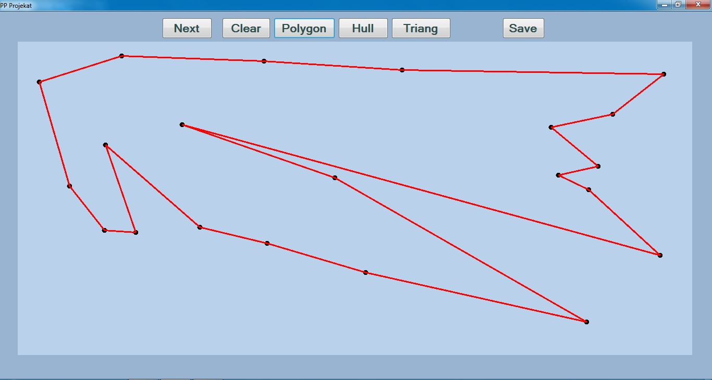
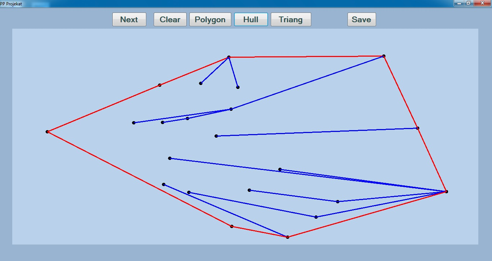
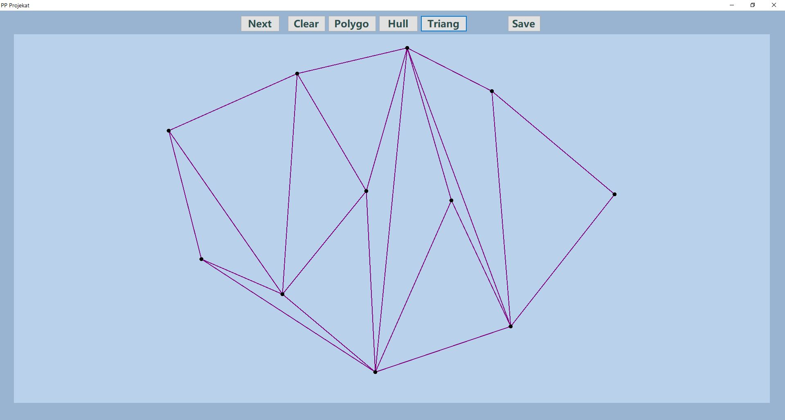

# 2020_Trijangulacija
- Opis projekta: Projekat simulira rad geometrijskih algoritama:
  - Polygon, sortira tačke ravni tako da one redom označavaju temena prostog mnogougla;
  - Hull, koristi algoritam polygon, a zatim izbacuje temena koja se ne nalaze u konveksnom omotaču i
  - Triang, pravi triangulaciju tačaka ravni tehnikom zavadi pa vladaj (u okviru ovog algoritma je implementiran jos jedan algoritam za konveksni omotač).

- O algoritmima: Naš cilj je bio da implementiramo sto efikasnije algoritme,a složenost svih algoritama je O(nlogn). A evo i objašnjenja zašto:

 
Algoritam polygon za početak nalazi tačku A sa najmanjom X koordinatom, ukoliko postoji više tačaka bira se ona sa najmanjom Y koordinatom. Ovo se radi linearnom pretragom,složenost O(n). Zatim preostale tačke sortira prema uglu koji obrazuju prave kroz tačku A sa pozitivnim delom X ose, ukoliko postoji vise tačaka koje grade isti ugao, one se dalje sortiraju prema udalenosti od tačke A, složenost ovog dela algoritma je O(nlogn) zbog sortiranje (uporedjivanje dveju tacaka je O(1)). Tako dobijamo slozenost algoritma O(n+nlogn)=O(nlogn). 
         
    
  
 
 Algoritam Hull prvo sortira tačke tako da one obrazuju prost mnogougao koristeći algoritam Polygon, složenost O(nlogn). Pošto su tacke sortirane u smeru kretanja kazaljki na satu, krecući se po ivicama prostog mnogougla sa desne strane nam se nalazi unutrašnjost mnogougla. Tu činjenicu koristi ovaj algoritam, on se "kreće"po ivicama sve dok u temenu "skrene" desno i ta temena ubacuje u konveksni omotac, ukoliko naidje na mesto gde je potrebno "skrenuti" levo za neko teme, on brise tacke iz konveksnog omotača sve dok se ne pojavi ona iz koje se skrece desno za to teme, složenost O(n) jer najvise jednom se svako teme ubaci i izbaci iz konveksnog omotača. Ukupno O(n+nlogn)=O(nlogn).   
 
 
  Algoritam Triang koristi tehniku zavadi pa vladaj i ukupne je složenosti O(nlogn). Sastoji se iz nekoliko podalgoritama i zaključaka. Osnovni zaključak je da se svaka trijangulacija nalazi unutar konveksnog omotača tačaka i može uključivati i sam konveksni omotač, stoga koristimo taj algoritam kao osnovu. Koraci algoritma: tačke se prvo sortiraju po X osi kao priprema za tehniku zavadi pa vladaj, onda skup tačaka delimo na dva dela, rešavamo trijangulaciju na manjem skupu pa spajamo. Već smo zaključili da je trijangulacija u konveksnom poligonu tako da trijangulacije levog i desnog skupa možemo da posmatramo kao konveksne poligone. Spajanje zatim funkcioniše na sledeći način: nađemo zajedničke tangente za ta dva poligona u O(n) - može linearnim pomeranjem po tačkama, to su gornja i donja granica trijangulacije, zatim je potrebno docrtati duži izvan prvobitnih poligona tako da sve zajedno čini trijangulaciju. To takođe možemo uraditi linearno u O(n) prolaskom po unutrašnjim tačkama vodeći računa da nijedna dodata duž ne seče neku već postojeću, za to se služimo orijentacijom trougla koju možemo proveriti u O(1) složenosti.
Tako da je ukupna složenost algoritma O(nlogn) zbog dve stavke: sortiranje koje se jednom uradi ima tu složenost ali i podela na dva dela svaki put je O(logn), dok su operacije koje se izvršavaju u svakoj podeli složenosti O(c*n) gde je c neka konstanta koja ne utiče na složenost, odatle i zaključak da je ukupna složenost O(nlogn)
   
   
   

   

  - A evo i kratkog uputstva:
    - Klikom na dugme Next generisu se 20 nausmicnih tacaka
    - Dugme Clear brise sve sa povrsine za crtanje(ne čuvajući prethodne tacke)
    - Dugmići Polygon,Hull i Triang simuliraju rad istoimenih algoritama postupno
    - Save ispisuje u datoteku poslednji izvrseni algoritam u formatu:
      - Broj koji označava koji je poslednji izvršeni algoritam - svaki ima svoju oznaku
      - Liniju po liniju podatke koji su izgenerisani pokretanjem tog algoritma, npr. trijangulacija ispisuje tačke koje su korišćene i sve duži koje su iscrtane prilikom algoritma
      - Cilj formata fajla je da parsiranje bude jednostavno da bi se vrlo lako moglo ponovo upotrebiti po potrebi ili pregledati automatski (nije namenjen za čitanje od strane čoveka, već za dalju upotrebu rezultata od strane nekog programa)
    - Moguće je i dodavanje novih tačaka klikom na željenu lokaciju

- Korišćen je jezik C#, a projekat je kucan i prevodjen u razvojnom okruženju Visual Studio.

- Izvrsni fajl se moze preuzeti [ovde](https://github.com/matf-pp/2020_Trijangulacija/releases/download/v1/TrijangulacijaTacaka.exe), i napravljen je za operativni sistem Windows, dovoljno je skinuti i otvoriti .exe fajl. 

- Članovi tima:
  - Dejana Mandić 8/2017, mr17008@alas.matf.bg.ac.rs
  - Milan Kocić   58/2017,  mr17058@alas.matf.bg.ac.rs

