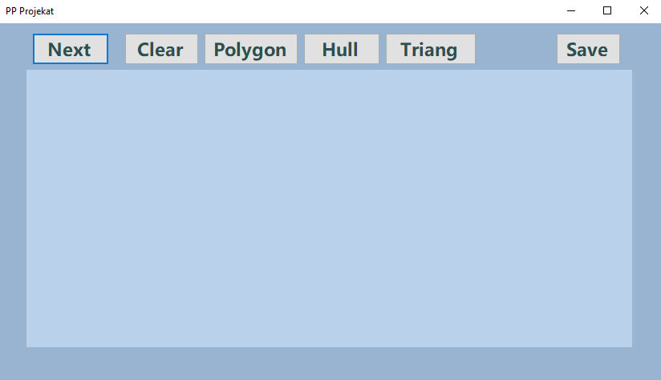

# 2020_Trijangulacija
- Opis projekta: Projekat simulira rad geometrijskih algoritama:
  - Polygon, sortira tacke ravni tako da one redom označavaju temena prostog mnogougla;
  - Hull, koristi algoritam polygon, a zatim izbacuje temena koja se ne nalaze u konveksnom omotaču i
  - Triang, pravi triangulaciju tačaka ravni tehnikom zavadi pa vladaj (u okviru ovog algoritma je implementiran jos jedan algoritam za konveksni omotač).
  
  Naš cilj je bio da implementiramo sto efikasnije algoritme,a složenost svih algoritama je O(nlogn).
  
  Prozor nakon pokretanja porgrama izgleda ovako: 
 
  

  A evo i kratkog uputstva:
    - Klikom na dugme Next generisu se 20 nausmicnih tacaka
    - Dugme Clear brise sve sa povrsine za crtanje(ne čuvajući prethodne tacke)
    - Dugmići Polygon,Hull i Triang simuliraju rad istoimenih algoritama postupno
    - Save ispisuje u datoteku poslednji izvrseni algoritam
    - Moguće je i dodavanje novih tačaka klikom na željenu lokaciju

- Korišćen je jezik C#, a projekat je kucan i prevodjen u razvojnom okruženju Visual Studio.

- Izvrsni fajl se moze preuzeti [ovde](https://github.com/matf-pp/2020_Trijangulacija/releases/download/v1/TrijangulacijaTacaka.exe), i napravljen je za operativni sistem Windows, dovoljno je skinuti i otvoriti .exe fajl. 

- Članovi tima:
  - Dejana Mandić 8/2017, mr17008@alas.matf.bg.ac.rs
  - Milan Kocić   58/2017,  mr17058@alas.matf.bg.ac.rs

